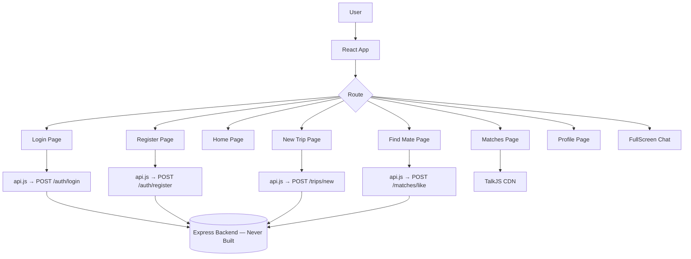

# 🌍 WanderMate — Detailed Project Overview

## What is WanderMate?

**WanderMate** is a travel companion matching web application. The core idea is similar to a "Tinder for travel partners" — users register with their personal preferences (diet, budget style, language, etc.), post upcoming trips, and the app finds other users whose trips and preferences align well with theirs. Matched users can then communicate via an integrated chat system.

---

## 🏗️ Original Architecture (v1 — Pre-Rebuild)

```
WanderMate/
├── client/          ← React frontend (Create React App)
│   └── src/
│       ├── App.js           ← Root router
│       ├── api.js           ← Centralized API call layer
│       ├── index.js         ← App entry point
│       ├── index.css        ← Global base styles
│       ├── App.css          ← App-level styles (mostly CRA defaults)
│       └── components/      ← All page components
│           ├── Login.jsx
│           ├── Register.jsx
│           ├── Home.jsx
│           ├── NewTrip.jsx
│           ├── FindMate.jsx
│           ├── Matches.jsx
│           ├── Profile.jsx
│           ├── FullScreenChat.jsx
│           └── ErrorPage.jsx
└── server/          ← Express backend (was EMPTY — never built)
```

> **Note**: The original `client/` and `server/` directories have been removed. The codebase is being rebuilt from scratch per the plan in `PLAN.md`. This file documents what existed in v1 for historical reference.

---

## 🧰 Original Tech Stack (v1)

| Layer | Technology |
|---|---|
| **Frontend Framework** | React 19 (Create React App) |
| **Routing** | React Router DOM v7 |
| **Styling** | Bootstrap (via class names in JSX) + minimal vanilla CSS |
| **PDF Export** | jsPDF (dynamic import) |
| **Real-time Chat** | TalkJS (CDN integration — partially set up) |
| **Backend (planned)** | Express.js on `http://localhost:5000` |
| **Session/Auth** | Cookie-based sessions (`credentials: "include"`) |
| **Chat Storage** | `sessionStorage` (local, not persisted to server) |

---

## 📄 Original Pages & Components (v1)

### 1. `Login.jsx` → `/login`
- Simple username + password form
- Calls `loginUser()` from `api.js`
- On success, navigates to `/` (Home)
- Displays error message if login fails

### 2. `Register.jsx` → `/register`
- Collects a rich set of user preferences:
  - `username`, `password`, `first_name`, `last_name`, `email`
  - `date_of_birth`, `gender`
  - `financial_nature` → Spender / Normal / Saver
  - `dietary_restrictions` → No restriction / Vegetarian / Vegan
  - `language_match`
- Renders all fields dynamically from `formData` keys
- Calls `onRegister(formData)` prop — **but this prop was never wired up in `App.js`**

### 3. `Home.jsx` → `/`
- Displays a greeting with the username
- Shows a dropdown to select an existing trip and "Find Partner"
- Contains a Bootstrap navbar with links to all main pages
- **`username` and `trips` are received as props** — but `App.js` never passed them

### 4. `NewTrip.jsx` → `/new_trip`
- Form to create a new trip with:
  - `destination`, `start_date`, `end_date`
  - `nature_trip` → No preferences / Urban / Trekking and Nature
  - `trip_preferences` → No preferences / Guided tours / Cultural / Extreme / Culinary
- Calls `onSubmit(formData)` prop — **also not wired in `App.js`**

### 5. `FindMate.jsx` → `/find_mate`
- Displays a list of potential travel companions (scored matches)
- Shows name, destination, trip dates per candidate
- Data came via `initialTripsScores` prop — **never fetched from the API**
- Shows "No recommendations" if empty

### 6. `Matches.jsx` → `/matches`
- Shows a table of mutually matched users
- Integrated **TalkJS** via CDN script to embed chat windows per matched user
- Had a `YOUR_TALKJS_APP_ID` placeholder — **never configured**
- Both `currentUser` and `matchedUsers` were props — **not connected to any state or API calls**

### 7. `Profile.jsx` → `/profile`
- Displayed personal user details and a trips history table
- Computed age client-side from `date_of_birth`
- Expected `user` and `trips` as props — **never passed from App.js**

### 8. `FullScreenChat.jsx` → `/chat`
- A standalone local chat UI (NOT connected to TalkJS or any server)
- Messages stored only in React state + `sessionStorage`
- Features: Send message, Export to PDF (via jsPDF), Clear chat, Back to minimized
- A placeholder/demo — did not actually communicate with anyone

### 9. `ErrorPage.jsx`
- Simple error display component
- Accepted an `errorMessage` prop — not used as a route in `App.js`

---

## 🔌 Original API Layer (`api.js`)

All API calls pointed to `http://localhost:5000/api` — an Express backend that was never built.

| Function | Method | Endpoint | Purpose |
|---|---|---|---|
| `loginUser(credentials)` | POST | `/auth/login` | Authenticate a user |
| `registerUser(data)` | POST | `/auth/register` | Register a new user |
| `getMyTrips()` | GET | `/trips/my` | Get logged-in user's trips |
| `addTrip(data)` | POST | `/trips/new` | Create a new trip |
| `getMatches()` | GET | `/matches` | Get current user's matches |
| `likeUser(palId)` | POST | `/matches/like` | Like/swipe a potential match |

All authenticated calls used `credentials: "include"` for cookie-based sessions.

---

## 🔗 Original Data Flow



---

## ⚠️ Key Issues & Gaps (v1)

| Issue | Severity | Details |
|---|---|---|
| **Server directory was empty** | 🔴 Critical | No backend existed. All API calls failed. |
| **No global state / Context** | 🔴 Critical | `App.js` rendered components with no props. Pages were blank/broken. |
| **TalkJS not configured** | 🟠 High | `YOUR_TALKJS_APP_ID` placeholder. Chat never worked. |
| **Register/NewTrip props not wired** | 🟠 High | `onRegister` and `onSubmit` callbacks were never provided. Submitting forms did nothing. |
| **`api.js` functions never called** | 🟡 Medium | `getMatches`, `getMyTrips`, `likeUser` existed but were never called in any component. |
| **Inconsistent branding** | 🟡 Medium | Some pages said "EXPLORE HUB", others "WanderMate". Logo paths also differed. |
| **FullScreenChat was local-only** | 🟡 Medium | Chat did not persist to a server or communicate with any real user. |
| **No authentication guard** | 🟡 Medium | All routes were publicly accessible — no redirect to `/login` for unauthenticated users. |
| **Minimal CSS** | 🟢 Low | Styling was mostly Bootstrap class names with very little custom design. |

---

## 🗺️ Original Routing Map (v1)

```
/           → Home.jsx
/login      → Login.jsx
/register   → Register.jsx
/new_trip   → NewTrip.jsx
/profile    → Profile.jsx
/find_mate  → FindMate.jsx
/matches    → Matches.jsx
/chat       → FullScreenChat.jsx
```

---

## 🔄 What Changed in the Rebuild

| Area | v1 (Old) | v2 (New — per PLAN.md) |
|---|---|---|
| **Bundler** | Create React App | Vite |
| **Backend** | Express (never built) | Convex (serverless, real-time) |
| **Auth** | Custom username/password | Clerk (OAuth, email, social) |
| **Chat** | TalkJS placeholder + sessionStorage | Convex real-time subscriptions |
| **State** | No state at all | Convex `useQuery` / `useMutation` hooks |
| **Styling** | Bootstrap class spam | Vanilla CSS design system + Framer Motion |
| **Routing** | 8 flat routes | Nested `/app/*` protected shell |

> See `PLAN.md` for the full step-by-step rebuild plan.
